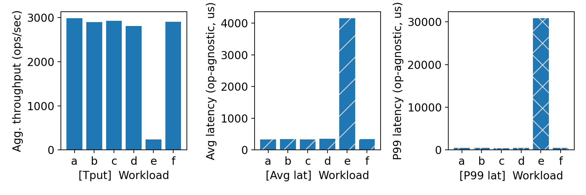
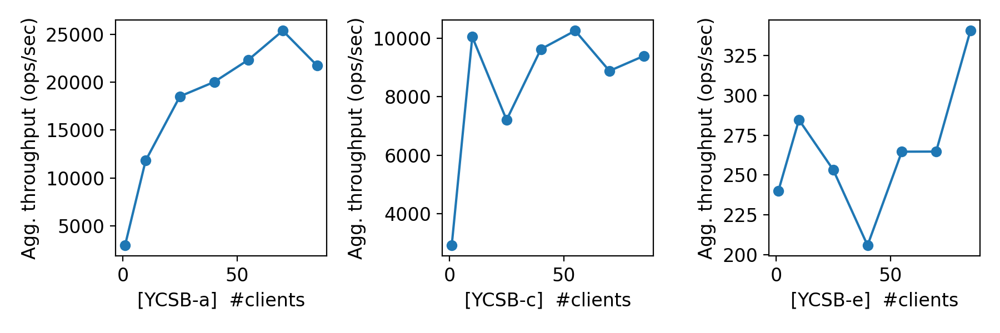
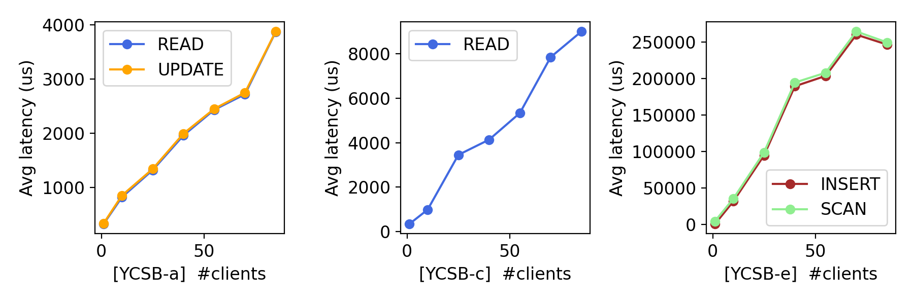

# CS 739 MadKV Project 1

**Group members**: 
- Name `Gokulnath Sourirajan`,  Email `sourirajan@wisc.edu`
- Name `Thilak Raj Murugan`,    Email `tmurugan2@wisc.edu`

## Design Walkthrough

We implemented a Go-based gRPC key–value store with separate client and server binaries. This separation allows the client and server applications to run independently, enabling easier testing, deployment, and scalability.

### Code Structure
The key–value store implementation is organized under the go_grpc directory. The structure of this directory is shown below:

### Directory Overview
#### 1) client/
Contains the gRPC client implementation. The main.go file initializes the client, establishes a connection to the server, and performs RPC calls.

#### 2) server/
Contains the gRPC server implementation. The main.go file starts the gRPC server and registers the key/value service.

##### 3) proto/
Cotains the Protocol Buffers definitions and generated code:
- kv.proto – Defines the service interface and message types.
- kv.pb.go – Generated Protobuf message code.
- kv_grpc.pb.go – Generated gRPC service bindings.

The go.mod & go.sum manage module dependencies for the Go project.

## Server Design

The server uses a simple go’s map[string]string for in-memory storage with a sync.RWMutex to ensure linearizability. Each RPC handler acquires the mutex before accessing the shared map, creating a total ordering of operations. 

For Scan, the server snapshots matching keys while holding the lock, sorts them lexicographically, then releases the lock before streaming results. The server accepts the listen address via command-line argument.

The server is also run using a single thread.

## RPC Protocol Setup

We use gRPC with Protocol Buffers (proto3) defining 5 RPC methods: Put, Swap, Get, Scan, and Delete. All operations except Scan are unary RPCs; Scan uses server-side streaming to efficiently return large result sets. Each request includes key/value strings; responses include boolean flags (exists, already_exists) to distinguish null values from non-existent keys. The Scan operation takes start_key and end_key (inclusive) and streams back sorted key-value pairs.

## Self-provided Testcases

<u>Found the following testcase results:</u> 1, 2, 3, 4, 5

You will run some testcases during demo time.

### Explanations

#### Testcase 1: Basic Operations Coverage (Single Client Case)
- <u>Objective</u>: This testcase covers all five RPC operations (PUT, GET, SWAP, SCAN, DELETE) on both existing and non-existing keys, verifying correct behavior for success and failure cases.
- <u>Test Procedure</u>: A single client executes a sequence including multiple PUTs, GETs on existing/non-existing keys, SWAPs on existing/non-existing keys, DELETEs on existing/non-existing keys, followed by a SCAN over a key range.
- <u>Key Results</u>: PUTs on new keys return not_found. GET on an existing key returns the value, while GET on a non-existent key returns null. SWAP returns the old value and updates the key, or returns null if the key does not exist. DELETE returns found for an existing key and not_found otherwise. SCAN correctly returns keys within the range that were not deleted.

#### Testcase 2: Edge Cases and State Transitions (Single Client Case)
- <u>Objective</u>: Tests PUT overwrites, multiple consecutive operations on the same key, SWAP chaining, repeated DELETE operations, boundary conditions for SCAN (single-key range, empty range, inverted range), and operations on deleted keys.
- <u>Test Procedure</u>: A sequence of operations that includes two PUTs on the same key, two SWAPs on the same key, a SWAP on a non-existent key, two consecutive DELETEs on the same key, and multiple boundary/inverted range SCAN operations.
- <u>Key Results</u>: The first PUT on a key returns not_found, and the second (overwrite) returns found (with already_exists=true). Chained SWAPs return the correct intermediate old values. DELETE is idempotent, with the first returning found and the second returning not_found. SCAN operations on boundary, empty, and inverted ranges correctly return empty results or the keys within the valid range.

#### Testcase 3: Independent Key Spaces (Concurrent Clients, No Conflicts)
- <u>Objective</u>: This testcase verifies that concurrent clients operating on non-overlapping key spaces execute correctly without mutual interference. Each client performs all operation types (PUT with overwrites, GET, SWAP, DELETE, SCAN including empty scans), proving the system handles parallel non-conflicting workloads correctly.
- <u>Test Procedure</u>: Client A operates exclusively on the key1-key4 range, and Client B operates exclusively on the key5-key8 range. Both clients execute an identical sequence of all operation types (PUT, GET, SWAP, DELETE, SCAN) concurrently.
- <u>Key Results</u>: Both clients successfully perform all operations on their respective key ranges. Client A's operations never observe keys from Client B, and vice-versa, confirming isolation.

#### Testcase 4: Partial Key Overlap (Concurrent Interfering Clients)
- <u>Objective</u>: Tests concurrent PUT overwrites on the same keys, SWAP operations returning correct old values under contention, DELETE races, read-after-write consistency (GET immediately after concurrent PUT/SWAP), and SCAN consistency during concurrent modifications. Operations on key1 remain conflict-free (only Client A), demonstrating correct handling of both shared and isolated keys within the same execution.
- <u>Test Procedure</u>: Client A and Client B run concurrently, with shared operations on key2, key3, and key4. The operation sequence includes concurrent PUT overwrites, SWAPs, DELETE races, and SCANs over the shared range.
- <u>Key Results</u>: Operations on shared keys must serialize in a valid, linearizable order. All observed values (e.g., in GET and SWAP return values) must be consistent with some sequential execution of the concurrent operations. Operations on non-shared keys (e.g., key1 for Client A) remain conflict-free.

#### Testcase 5: Maximum Contention (Concurrent Interfering Clients)
- <u>Objective</u>: This testcase stresses maximum concurrency with all three clients performing all operation types on the same keys. It validates: (1) PUT overwrites under heavy contention, (2) SWAP chains where multiple clients swap the same key multiple times, (3) DELETE races where all clients attempt deletion, (4) read-after-write sequences (GET immediately following concurrent PUT/SWAP), (5) PUT-after-DELETE recreating deleted keys, and (6) SCAN consistency during maximum interference. The testcase ensures lock-based concurrency control correctly serializes all conflicting operations while maintaining linearizability.
- <u>Test Procedure</u>: Three clients (Client A, B, and C) run concurrently, all heavily contending on key1 and key2. They perform all operation types (PUT, GET, SWAP, DELETE, SCAN) multiple times on these shared keys.
- <u>Key Results</u>: The result must be non-deterministic but linearizable. All GETs and SWAPs must observe values consistent with a valid serialization order of the operations. DELETE races resolve with only the first attempt returning found. SCAN operations must return a consistent snapshot despite the heavy, simultaneous modifications.

## Fuzz Testing

<u>Parsed the following fuzz testing results:</u>

num_clis | conflict | outcome
:-: | :-: | :-:
1 | no | PASSED
3 | no | PASSED
3 | yes | PASSED

You will run a multi-client conflicting-keys fuzz test during demo time.

### Comments

We observed that the server correctly handles concurrent operations on shared keys, maintaining linearizability and returning consistent results. The fuzz testing revealed no crashes or assertion failures, indicating that our concurrency control mechanisms are robust under various workloads and contention levels.

## YCSB Benchmarking

<u>Single-client throughput/latency across workloads:</u>

<u>Agg. throughput trend vs. number of clients:</u>

<u>Avg. latency trend vs. number of clients:</u>

### Comments

---

#### Single Client

The througput for all the workloads are nearly the same except workload e. It is because workload has lot of scan rpc requests which is CPU intensive and has higher latency for each request. This can be observed in workload e having a higher avg. & p99 latency compared to workloads a-d and workload f.

#### Agg. Througput vs no. of client Trend

For larger no. of clients, the avg. throughput of workload A is way higher than throughput of C and E. 

- Avg Throughput of A ~ 22k ops/sec
- Avg Throughput of C ~ 9k ops/sec
- Avg Throughput of E ~ 275 ops/sec

Hence workload A is highly scalable compared to C & E. This is because A workload's r/w ratio is 50/50. Whereas E is scan heavy.

### Avg. Latency

- For Workload A, the read and write avg. latency increases linearly upto 4ms. This is due increased no. of requests being sent to a single threaded server. (Increased idle time due to lock contention).
- For Workload C, the read avg. latency increases near linearly upto 8.5ms.
- For workload A, the insert and scan avg. latency goes from 0 to 250ms. It is much larger beacuses locks have to be held for longer duration due to snapshoting during scans.

## Additional Discussion

### 5.1 Multi-Threaded Server Support

We implemented multi-threaded server support using mutex locks (sync.RWMutex) for concurrent request processing, which ensures linearizability. Our conservative design used exclusive locks (mu.Lock()) for all operations, including reads, to guarantee strict linearizability and simplify correctness, sacrificing some read concurrency. The implementation was validated with fuzz testing. However, the server was run single-threaded for the presented benchmarking results to establish a clean performance baseline. This design prioritizes correctness over performance, noting that an upgrade to multiple threads would benefit heavy production workloads.

### 5.2 RPC Streaming Optimization for SCAN
We implemented SCAN using gRPC server-side streaming for efficiency, which provides several key advantages:

- Memory Efficiency: Results are sent incrementally, preventing memory spikes for large key ranges.
- Lower Latency: The client can begin processing results immediately, reducing perceived latency.
- Backpressure Handling: Built-in gRPC flow control automatically throttles the server if the client processes slowly.

The implementation ensures snapshot isolation by taking a sorted snapshot of keys while holding a lock, which is then released before streaming the lexicographically sorted results to balance consistency with concurrency.

### 5.3 Request ID Generation for Linearizability Validation

We implemented atomic, monotonically increasing Request IDs for each RPC operation. This system is essential for:

- **Linearizability Validation**: The IDs enable the reconstruction of the total serialization order of concurrent operations (Testcases 4 and 5), allowing for causality tracking and automated checking to confirm a valid sequential permutation exists.
- **Concurrency Debugging**: The unique IDs help identify the exact interleaving of operations and trace which specific operation wrote an observed value, proving that non-determinism is a result of valid serializations.
- **Logging**: A comprehensive log structure utilizing the Request ID, client, operation type, key, and result was invaluable for concurrent testcase development.

