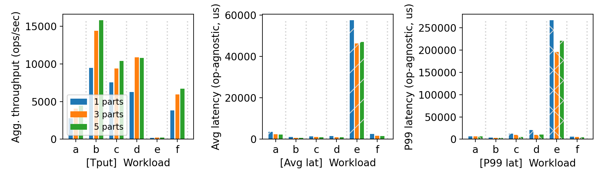
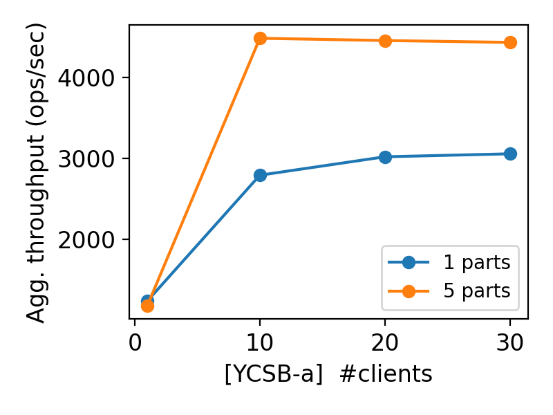

# CS 739 MadKV Project 2

**Group members**: 
- Name `Gokulnath Sourirajan`,  Email `sourirajan@wisc.edu`
- Name `Thilak Raj Murugan`,    Email `tmurugan2@wisc.edu`

## Design Walkthrough

### Overview

Durability and Paritioning of key space is introduced to the system in the following manner:

- **Durability**: 
  - Added durable storage using BoltDB (bbolt fork): https://github.com/etcd-io/bbolt. Bolt is a pure Go, embedded key/value storage engine based on a memory-mapped B+tree. It is designed for fast read access, ACID compliance, and simplicity.
  - Updates are first persisted on disk before updating the in-memory map data structure.
- **Partition**: 
  - We use range based partitioning. 
  - Before each RPC call, the client uses range partitioning to find the correct partition to make a RPC. 

### Client:

- During the client initialization, the clients gets the list of servers from the manager and connects to all the servers. 

### Server:

- When the server boots up, it registers itself with the manager and obtains the partition ID.
- Given a disk file path to durably persist the in-memory key-value pairs, we perform the following:

  1. Create a directory to store the file for the DB if it doesn't exist. bbolt mmaps the entire file to memory. This provides fast disk I/O.
  2. The key-value pairs are stored in a bucket within a file for a single partition.
  3. After registering with the manager, the server loads the key-value pairs present on disk, which is initially empty.

Whenever a new command arrives, bbolt uses transactions to perform a read or write. This ensures ACID properties. Updates are first persisted on disk before updating the in-memory map data structure.

### Proto: 
 
#### Add new service for manager with 2 functions:
 - RegisterServer - Used by kv store server to register it be part of the cluster whenever the server gets initiated. Returns partion ID of the server.
 - GetPartitionMap - Used by clients to get the list of servers part of the cluster. A map of partition ID and the server address is returned. Using this partition map, the clients connect to the servers.

## Self-provided Testcase

You will run the described testcase during demo time.

### Explanations

- No. of servers: 3
- No. of clients: 1
- Test1: PUT 9 keys, SWAP some (key0 ... key9)
- Test2: GET the 9 keys, SCAN some
- Test3: GET and SCAN only keys from 2nd and 3rd servers
- Test4: GET and SCAN only keys from 1st server
- Test5: GET, SCAN and SWAP keys from all servers

**Procedure**:
1. Start 3 servers.
2. Run Test1
    Observed: all 9 keys are PUT successfully, and SWAP works as expected.
3. Run Test2
    Observed: all 9 keys are fetched successfully via GET, and SCAN works as expected.
4. Kill the 1st server.
5. Run Test3
    Observed: all keys from 2nd and 3rd servers are fetched successfully via GET, and SCAN works as expected.
6. Run Test4
    Observed: Client fails to GET and SCAN keys from the 1st server, as expected. Indefinitely waits for the 1st server to recover, retrying indefinitely.
7. Restart the 1st server.
    Observed: The 1st server recovers successfully, and RPCs from Test4 completes.
8. Run Test5
    Observed: All keys from all servers are fetched successfully, and SCAN and SWAP work as expected, successfully regaining connectivity to the 1st server.

## Fuzz Testing

<u>Parsed the following fuzz testing results:</u>

num_servers | crashing | outcome
:-: | :-: | :-:
3 | no | PASSED
3 | yes | PASSED
5 | yes | PASSED

You will run a crashing/recovering fuzz test during demo time.

### Comments

We observed that the server correctly handles concurrent operations on shared keys, maintaining linearizability and returning consistent results. The fuzz testing revealed no assertion failures, indicating that our concurrency control mechanisms are robust under various workloads and contention levels.

We also noticed that crashing few partitions blocked the fuzz test, as it was retrying the request until a successful response is received. 

  - After restarting the crashed server, a successful response is returned; the fuzz test resumes and completes successfully. 

## YCSB Benchmarking

<u>10 clients throughput/latency across workloads & number of partitions:</u>

<u>Agg. throughput trend vs. number of clients w/ and w/o partitioning:</u>

### Comments

**1. 10 clients Throughout and Latency** 

#### Overview:

Metric| Value | Scenario
:-: | :-: | :-:
(Max) Agg. Throughput | 160k ops/s | Workload B, 5 servers
(Min) Agg. Throughput | 172  ops/s | Worload E, 1 server
(Max) Avg. Latency    | 57ms    | Workload E, 1 server
(Min) Avg. Latency    | 1.3ms   | Workload B, 5 servers 

#### Observations & Reasoning:

- Across workloads A, B, C and F, as we increase the no. of partitions, the agg. throughput increases as the key space gets partitioned and hence different partitions can be queried simultaneously. 

- Among all workloads, workload B has the highest agg. throughput of ~160k ops/s . This is because workload B is read heavy. Even though both B and C are read heavy, workload B has higher throughput than C as C hits more hot keys than B.

- Workload E has the lowest total throughput as it is SCAN heavy. Among all workloads, it also has the highest avg. & p99 latency, it is because it has to read multiple keys and send n/w requests to multiple servers involved in the range scan. 
  - Within workload E, the avg latency decreases with increase in no. of partitions, as multiple ranges of keyspace can be read simultaneously. (57ms, 1 partition), (43ms, 3 partitions), (44ms, 5 partitions). As we increase partition size, there is a tradeoff between latency decrease due to multiple range scans happening parallely on CPUs vs latency increase due to n/w roundtrip.

**2. Workload A: Total Throughput vs no. of clients:**

- The read:write ratio of workload A is 1:1.
- For a single partition, as we increase no. of clients the total throughput increases initially, but beyond 10 clients, it plateaus around 3000 op/s as there is lock contention when more read/write requests hit a single server. 
  - The same plateau effect can be observed for 5 partitions, though as we increase no. of clients beyond 20, along with lock contentions, clients have additional latency overhead of deserealizing/serealizing multiple protobuf request/responses from 5 different server connections. Whenever a new client gets added, additional time is consumed creating TCP handshakes with 5 different partitions.
- For the same no. of clients, as we increase the no. of partitions, we are able to server read/write requests parallely on different parts of the keyspace, hence the total throughput of 5 partitions (max: 4400 ops/s) is greater than that of 1 partition (max: 3000 ops/s).

## Additional Optimizations

- Better range partitioning to distribute load in a balanced manner. We use 2 different partitioning schemes (random and keySuffix partitioning) and change it dynamically based on workload type - fuzz/ycsb/random.
  - Random Key Partition: Partitions based on the first character across 62 possible characters (0-9, A-Z, a-z) for even load distribution
  - Key Suffix Partition: Used for keys with common prefixes (like "key" or "user_usertable") - removes the prefix to better partition over the remaining characters (typically 10 numeric characters) for more balanced distribution. If we don't remove prefix, all the keys would go to a single partition based on the first character "k" or "u". 

- SCAN Optimization: Initially for any given key range, we were hitting all the servers in the cluster. We later optimized clients to send a request to a server only if the keyspace present on that server is part of the range of keys scanned.

## AI Usage

We used AI for formatting logs.