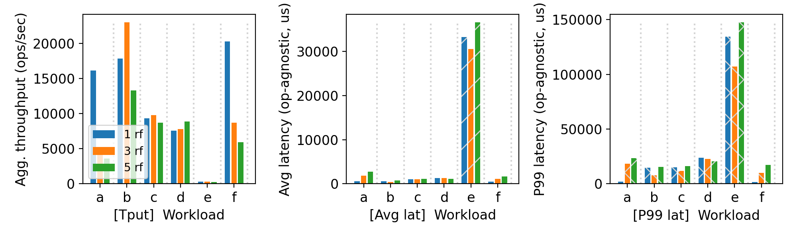
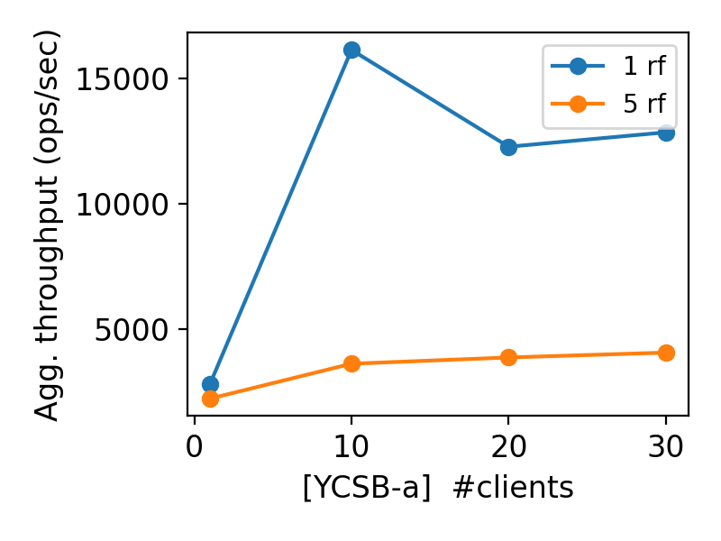

# CS 739 MadKV Project 3
- Name `Gokulnath Sourirajan`,  Email `sourirajan@wisc.edu`
- Name `Thilak Raj Murugan`,    Email `tmurugan2@wisc.edu`

## Design Walkthrough

### Overview

Durability and Paritioning of key space is introduced to the system in the following manner:

- **Durability**: 
  - Continued using BBolt for persistence of the KV store and the durable state of the raft consensus.
- **Replication**: 
  - We use raft consensus for replication. 
  - The leader server in each partition is responsible for handling all client requests and replicating the updates to the follower servers in the same partition. 
  - The leader server also handles the replication of the raft log entries to the followers and ensures that the followers are up to date with the latest state of the partition. 
  - The followers in each partition are responsible for applying the updates to their local state and responding to the leader server with the results of the operations. 
  - The leader server also handles the replication of the raft log entries to the followers and ensures that the followers are up to date with the latest state of the partition. 
  - In the event of a leader failure, the followers in the partition will elect a new leader to take over the responsibilities of handling client requests and replicating updates. 
  - The replication mechanism ensures that the data is replicated across multiple servers in the partition, providing fault tolerance and high availability for the key-value store. 

### Client:

- During the client initialization, the clients gets the list of servers from the manager and connects to all the servers. 
- Client begins with assuming that the first server in the partition is the leader. If the client receives a "not leader" response from the server, it will update its information about the leader and retry the request with the new leader server.
- Leader-Aware Retries in All RPC Handlers: Each handler now inspects the LeaderId field in every server response. Three cases are handled:
    - Case 1 — Leader Unknown: If LeaderId is empty, the client retries the same server after a brief delay (manager may still be electing).
    - Case 2 — Correct Leader: If the contacted server's index matches the LeaderId, the operation succeeds and returns.
    - Case 3 — Follower Redirect: If the server is a follower, the client extracts the leader's replica index from LeaderId and reconnects to the actual leader.
- Fallback to Next Replica on Network Failure: If an RPC fails with a connection error (leader unreachable), the client rotates targetIndex (learned leader index) to the next replica and retries. This ensures progress even when the assumed leader has crashed.

### Server:

1. Initialize RaftNode with node ID, peer IDs, state machine, BoltDB instance, and gRPC clients for peers.
2. Load persisted Raft state (currentTerm, votedFor, log entries) from BoltDB before starting the node.
3. Start background goroutines for Raft: apply loop, replication/heartbeat loop, and election timer loop.
4. Create another gRPC server for Raft RPCs (RequestVote, AppendEntries, InstallSnapshot).
5. Implement gRPC handlers for KV operations (Put, Get, Swap, Delete, Scan) that:
	 - Check if the node is the leader; if not, return the current leader ID for redirection.
	 - For write operations (Put, Swap, Delete), propose a command to the Raft node and wait for the response from the state machine via a channel.
	 - For read operations (Get, Scan), serve directly from the in-memory map protected by a mutex.

### Raft Consensus:
- A new go_grpc/raft/ package implements the Raft consensus algorithm, providing fault-tolerant log replication across partition replicas.
- Each RaftNode maintains three categories of state:
    - Persistent state: currentTerm, votedFor, and the replicated log.
    - Volatile state: commitIndex and lastApplied
    - Leader-specific volatile state: nextIndex and matchIndex maps per peer, tracking replication progress.
- The node role transitions between Follower --> Candidate --> Leader following the standard Raft protocol. A single raftmu mutex protects all state.
- There are 3 RPC handlers: RequestVote, AppendEntries, and InstallSnapshot, implementing the core Raft operations for leader election and log replication.
    - RequestVote: Followers vote for candidates during elections, granting their vote if the candidate's term is up-to-date and they haven't voted yet.
    - AppendEntries: The leader replicates log entries to followers and sends heartbeats. Followers accept entries if they match the expected log index and term, ensuring consistency.
    - InstallSnapshot: If a follower is too far behind, the leader can send a snapshot of the current state to bring it up to date, allowing it to catch up without replaying an excessively long log.
- The RaftNode interacts with the KV store server to apply committed log entries to the key-value state machine, ensuring that all replicas in the partition maintain a consistent view of the data.

#### Leader Election
- Election is triggered when a Follower's election timeout expires (random to avoid vote splits). The node:
    - Increments currentTerm, transitions to Candidate, votes for itself.
    - Sends RequestVote RPCs to all peers in parallel.
    - On majority (votes > N/2), transitions to Leader: appends a NoOp entry (to prevent uncommitted entries from prior terms), initializes nextIndex/matchIndex for all peers, and immediately signals the replication loop.

#### Log Replication
- The replicateAndHeartbeatLoop runs on a 250ms ticker (heartbeat) and immediately on ProposeCmd (replication). For each peer:
    - The leader builds an AppendEntries request with entries from nextIndex[peer] onward.
    - If the peer's nextIndex is before the snapshot boundary, InstallSnapshot is sent instead.
    - On success, matchIndex and nextIndex are updated. On rejection, nextIndex is decremented (using conflictIndex hint if available).
    - After all peer responses, tryCommit() advances commitIndex if a majority has replicated the entry.

#### Apply Loop
- A separate goroutine (applyLoop) watches applyCh. When commitIndex advances, it applies entries from lastApplied+1 to commitIndex to the KV state machine via sm.Apply(). NoOp entries are skipped.

##### Leader
 1. Reception: The KV handler (server/main.go) receives the PUT, checks isLeader(). If follower, returns immediately with LeaderId for client redirect.
 2. Proposal: The leader serializes the PUT into a Command, calls raftNode.ProposeCmd(), which appends it to the log and persists to disk.
 3. Replication: replicateCh is signaled. The replication loop broadcasts AppendEntries to all followers with the new entry. Followers validate, append, persist, and acknowledge.
 4. Commit: After majority acknowledgment, tryCommit() advances commitIndex. The leader's applyCh fires.
 5. Apply (Leader): applyCommittedEntries() deserializes the command and calls sm.Apply(), which writes to BoltDB and the in-memory map. The result is sent through responseCh.
 6. Response: The KV handler receives from responseCh and returns the PUT response to the client.

##### Follower
 1. Reception: The KV handler receives the PUT, calls isLeader(), discovers it is not the leader.
 2. Reject: Returns PutResponse{LeaderId: <current leader>} immediately — no log replication or apply occurs on the follower. The client is responsible for redirecting to the leader.

However, if the follower receives an AppendEntries from the leader (replication path):
 1. The AppendEntries handler validates term and log consistency.
 2. New entries are appended to the local log and persisted.
 3. If leaderCommit > commitIndex, the applyCh fires asynchronously.
 4. The applyLoop applies committed entries to the follower's BoltDB state machine, keeping it in sync with the leader. This ensures that followers maintain an up-to-date state, ready to take over as leader if needed.

### Proto: 
 
#### Add new service for raft consensus with 3 functions:
 - RequestVote - Used by the followers to request votes from other servers in the partition during leader election.
 - AppendEntries - Used by the leader to replicate log entries to the followers and to send heartbeats to maintain its leadership.
 - InstallSnapshot - Used by the leader to send a snapshot of the current state to a follower that is significantly behind in the log replication.

## Self-provided Testcases

You will run the four described testcase scenarios during demo time.

## Fuzz Testing

<u>Parsed the following fuzz testing results:</u>

server_rf | crashing | outcome
:-: | :-: | :-:
5 | no | PASSED
5 | yes | PASSED

You may be asked to run a crashing fuzz test during demo time.

### Comments

We observed that the server correctly handles concurrent operations on shared keys, maintaining linearizability and returning consistent results. The fuzz testing revealed no assertion failures, indicating that our concurrency control mechanisms are robust under various workloads and contention levels.

Even when crashing few partitions, the fuzz test was able to resume and complete successfully after the crashed server was restarted, demonstrating the system's fault tolerance and ability to recover from failures while maintaining data integrity.

## YCSB Benchmarking

<u>10 clients throughput/latency across workloads & replication factors:</u>

<u>Agg. throughput trend vs. number of clients with different replication factors:</u>

### Comments

Metric| Value | Scenario
:-: | :-: | :-:
(Max) Agg. Throughput | 23k ops/s | Workload B, 3 replicas
(Min) Agg. Throughput | 272  ops/s | Worload E, 5 replicas
(Max) Avg. Latency    | 350ms    | Workload E, 5 replicas
(Min) Avg. Latency    | 0.6ms   | Workload F, 1 replica 

- We observed that the throughput decreases as the replication factor increases, which is expected due to the additional overhead of replicating data across more servers. However, the system maintains reasonable performance even with higher replication factors, demonstrating the efficiency of our Raft implementation and the underlying BoltDB storage.

- We also noticed that the latency increases with higher replication factors, especially under write-heavy workloads, as the leader must wait for acknowledgments from more followers before committing entries. However, read-heavy workloads show less impact on latency, as reads can be served by any replica once the data is committed.

- Maximum throughput was achieved with workload B (95% reads, 5% writes) and a replication factor of 3, indicating that the system can handle read-heavy workloads efficiently even with multiple replicas. On the other hand, the minimum throughput was observed with workload E (50% reads, 50% writes) and a replication factor of 5, which is expected due to the increased overhead of handling more replicas and the balanced read/write mix.

- Maximum latency was observed with workload E and a replication factor of 5, which is likely due to the increased contention and overhead of replicating writes across multiple servers. Minimum latency was observed with workload F (100% reads) and a replication factor of 1, as there is no replication overhead and all reads can be served directly from the single replica.

- For workloads like A (50% reads, 50% writes) and F (100% reads), the throughput is substantially higher with a replication factor of 1 compared to 3, as expected. However, for other workloads, the performance is actually better with a replication factor of 3 compared to 1, which may be due to the increased availability and load distribution across replicas, allowing for better handling of concurrent requests.

- For workload A with varying clients, throughput increases with more clients, but the rate of increase diminishes as we approach the limits of the system's capacity. With a replication factor of 5, the throughput is generally lower than with a replication factor of 1 due to the overhead of replication, but it provides better fault tolerance and availability.

## Additional Discussion
